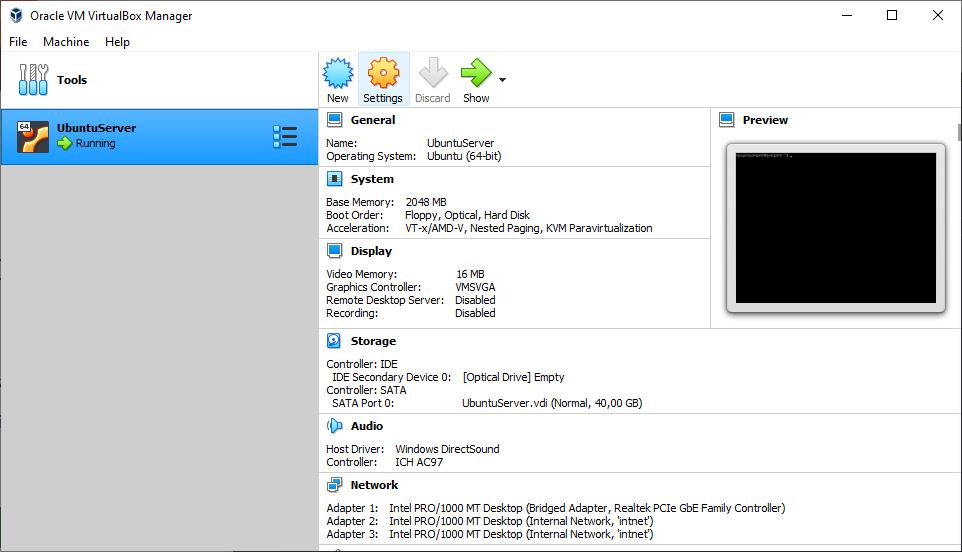
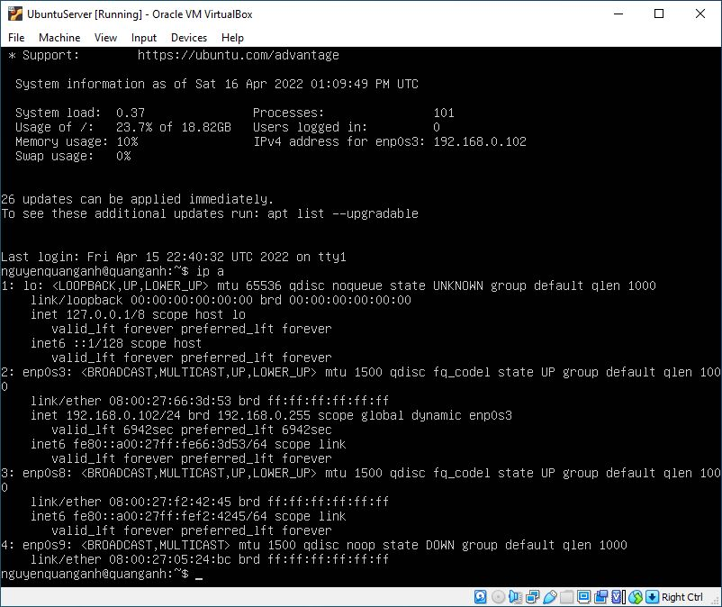
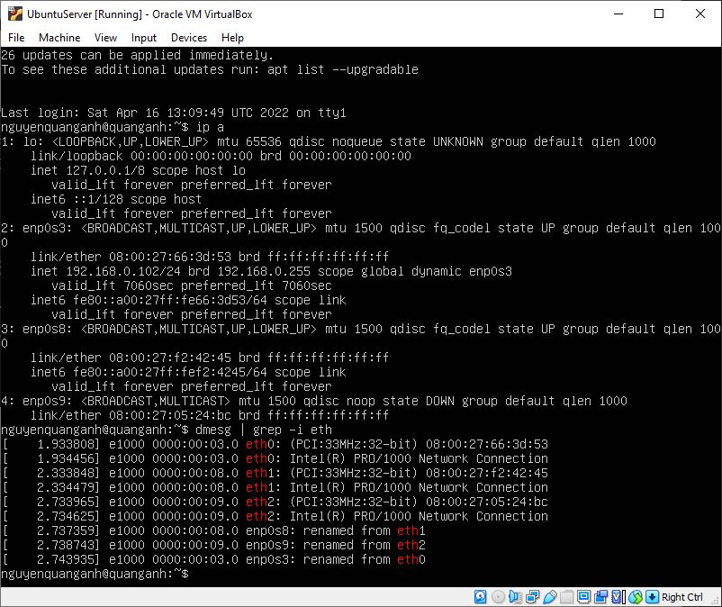
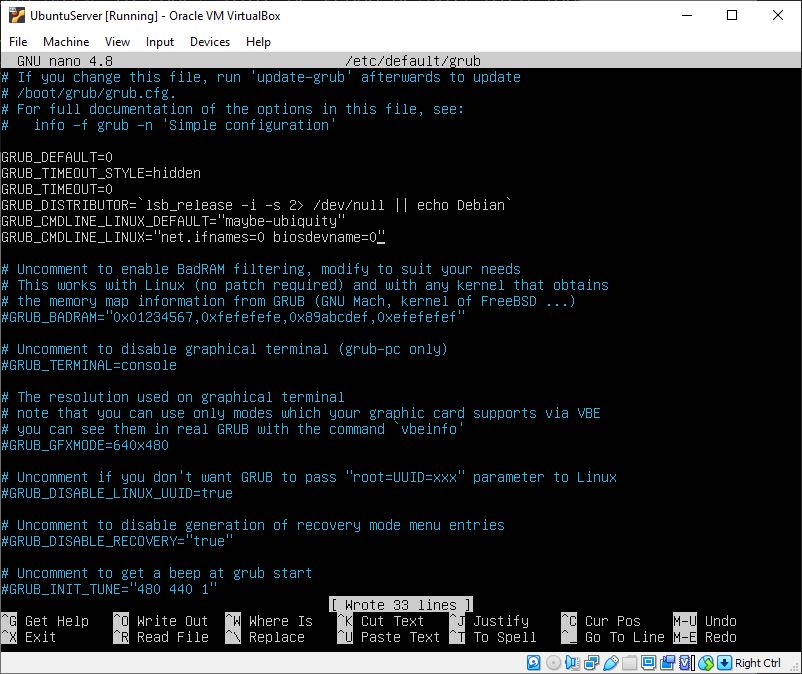
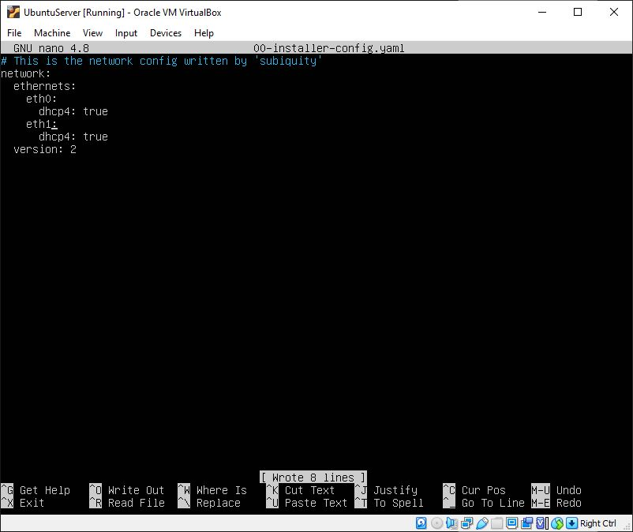
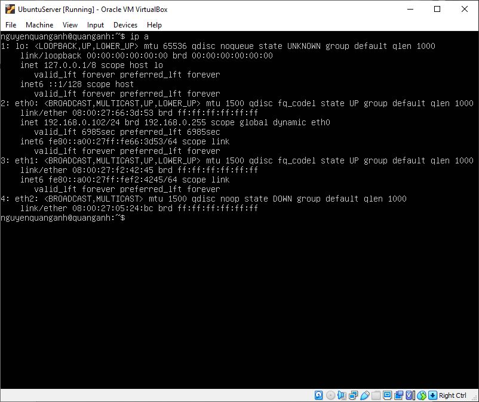
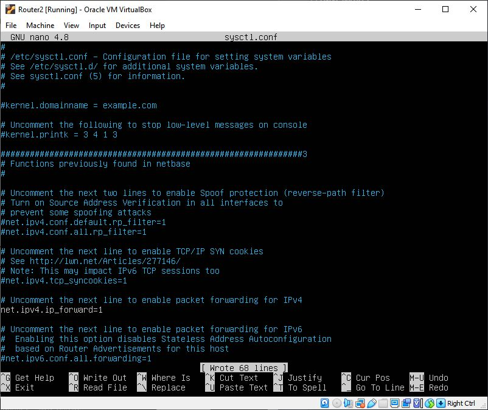
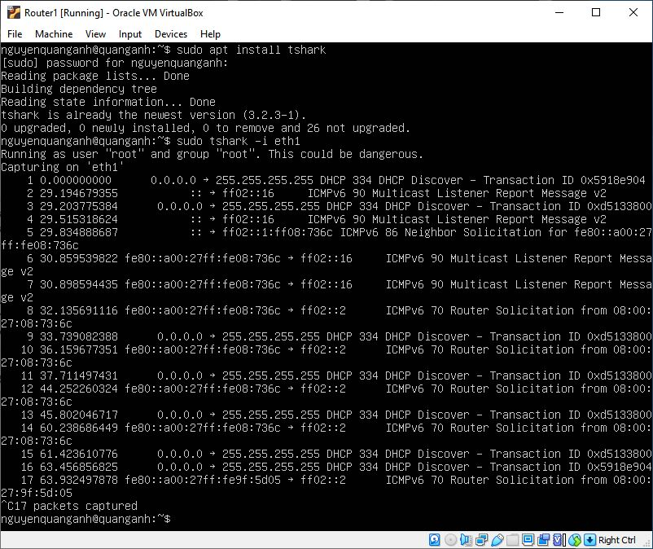
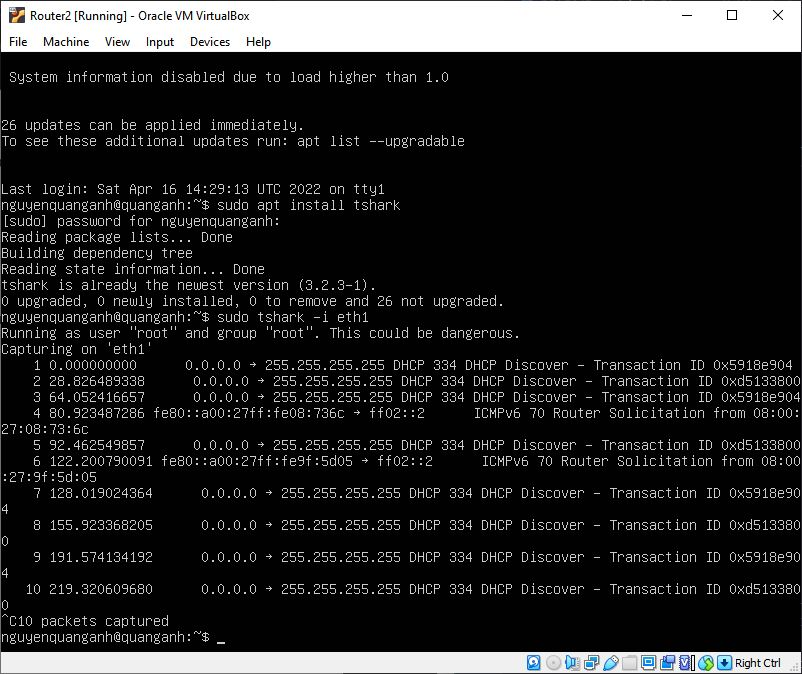

# Setup
- Download VirtualBox
- Download Ubuntu Server: https://ubuntu.com/download/server
- Setup initial virtual machine


- To change network name to "eth0" for convenience, first to get the interface's information, use `ip a`


- From the `dmesg` command, you can see that the device got renamed during the system boot
```txt
dmesg | grep -i eth
```

- To get an ethX back, edit the grub file:

```txt
sudo nano /etc/default/grub
```
Enter your password, look for "GRUB_CMDLINE_LINUX" then change

From:
```txt
GRUB_CMDLINE_LINUX=""
```
Change to:
```txt
GRUB_CMDLINE_LINUX="net.ifnames=0 biosdevname=0"
```

Note: save file

- Finally, edit the interface file in /etc/netplan (using `cd /`, then `cd etc/netplan/` and `ls` to get filename `00-network-manager-all.yaml`) and change the network device name so that you will have a DHCP or static IP address for eth0, eth1 and eth2 (using `sudo nano 00-network-manager-all.yaml`)



Reboot device after changing

The result is:


# Configure 6 interfaces by the command
- Flush the device before bringing it up

```txt
sudo ip addr flush dev eth0
```
- You should clone virtual machine to 4 VMs, choose Generate new MAC addresses for all network adapters
- Configure 6 interfaces by the command:
```txt
PCA: sudo ip -6 addr add 2001:2::10/64 dev eth1
PCB: sudo ip -6 addr add 2001:3::10/64 dev eth1
Router1: sudo ip -4 addr add 129.175.1.1 dev eth2
         sudo ip -6 addr add 2001:2::1/64 dev eth1
Router2: sudo ip -4 addr add 129.175.1.2 dev eth2
         sudo ip -6 addr add 2001:3::1/64 dev ethl
```
where -6 represents the ipv6 network, eth0 is the device's name and `2001:2::/64` is the inet6 prefix.

Activate devices (both Router1 and Router2)
```txt
sudo ip link set eth1 up
sudo ip link set eth2 up
```
Enable forwarding:
```txt
cd /
cd etc/
sudo nano sysctl.conf
```
Uncomment `net.ipv4.ip_forward=1` by delete # before that line

# Configure the tunnel between the two border routers
Write the command line to add the remote of IPv4 address to the tunnel in order to create a IPv6-in-IPv4 tunnel
- Router1: `$ sudo ip tunnel add tunnell mode sit remote 129.175.1.2 local 129.175.1.1 ttl 255`
- Router2: `$ sudo ip tunnel add tunnell mode sit remote 129.175.1.1 local 129.175.1.2 ttl 255`

To activate the tunnel, we use the command:
```txt
ip link set tunnell up
```
When finish, the tunnel will be show as an interface in ifconfig
- To add ipv6 address to the tunnel, use `sudo ip addr add 2001:2::/64 dev tunnell`

# Configure routing tables on all PCs
To flush all routes on the routing tables, the ip command options route flush table main are used. The full commands to run are:
```txt
sudo ip route flush table main
ip route show
```
# Observe with Wireshark
For Router1 or Router2
```txt
sudo apt install tshark
sudo tshark -i eth1
```
The results are:

